<div align="center"> 
<h1>Graduation Thesis</h1>


</div>

---
<p align="center">
 ShopLY</a>
</p>

<h2 align="center">Store Recommendation System</h2>

---

## 📖 Table of Contents
- [📝 Context](#-context)
- [📄 Introduction](#-introduction)
- [🌟 Project Highlights](#-project-highlights)
- [📌 Overview](#-overview)
- [🖧 System Architecture](#-system-architecture)
- [⿻ Layer](#-layer)
- [🌟 Core Features](#-core-features)
- [⚙️ All Features](#-all-features)
- [📱 UI](#-ui)
- [💻 Technical](#-technical)
- [🧠 Algorithms](#-algorithms)
- [📺 Video Demo](#-video-demo)
- [👥 Members](#-members)
- [ℹ️ Source](#source)

--

## 📝 Context
In today’s era of digitalization and rapidly advancing technology, people are increasingly shifting their everyday needs to online platforms—such as making payments, working remotely, and especially shopping online through e-commerce websites, which are growing at a fast and widespread rate. Most types of products are now listed and traded on these e-commerce platforms.

Currently, thousands of e-commerce websites exist both in Vietnam and around the world, offering a wide variety of product categories. However, due to the sheer number and scale of these platforms, many issues still persist—most notably problems related to product and store quality control. In reality, many users have encountered situations where the products they received did not match the description, or they ended up buying counterfeit or low-quality items. Moreover, finding the right product can take a significant amount of time, as users often need to search, compare, and analyze options across multiple stores.

---

## 📄 Introduction
The project is a store recommendation system developed as an e-commerce platform. It delivers personalized suggestions by analyzing user data, such as purchase history, reviews, and other inputs. Store-specific factors, including follower count,ratings, reviews, and other relevant metrics, are also considered to enhance the credibility of recommendations.

---

## 🌟 Project Highlights
Advanced Technical Approaches:
* **Trust-focused store recommendations**: The system not only suggests products but also emphasizes reputable stores. Recommendations are based on stores rated as reliable for users, reducing the risk of purchasing low-quality items.
* **Machine learning algorithms**: The system integrates Neighbor-based Collaborative Filtering to suggest stores selling the searched products.
* **Personalized recommendations**: Store ratings from users with similar preferences are used to suggest products tailored to the target user's tastes.
* **Optimized search speed**: Elasticsearch is employed to handle text data efficiently, improving search performance and response time for users.

---

## 📌 Overview
<p align="center">
 </a>
</p>

---

## 🖧 System Architecture
<p align="center">
 </a>
</p>

---

## ⿻ Layer
* The project applies the clean architecture principles to implement the code.

### Front-end
``` 
└── 📁ShopRecommenderSystem
    └── 📁public
    └── 📁src
        └── 📁assets          => Static resources (images, logos, icons)
            └── 📁BrandLogos
            └── 📁HomeImg
            └── ...
        └── 📁components      => Reusable UI components
            └── 📁Card
            └── 📁Footer
            └── 📁Header
            ├── ...
        └── 📁EventBus        => Event-based communication between components
        └── 📁HOC             => Higher-Order Components for extra logic
        └── 📁layouts         => Page layout templates
            └── 📁DefaultLayout
            └── 📁HeaderOnly
            ├── index.js
        └── 📁pages           => Individual page components (views/screens)
            └── 📁AdminDoashboard
            └── 📁Login
            └── ...
        └── 📁routes          => App routes mapping URLs to pages
        └── 📁services        => API services for backend communication
            └── 📁AdminApi
            └── 📁CheckoutApi
            └── ...
            ├── axios-customize.js
        └── 📁styles          => Global CSS and resets
            ├── global.css
            ├── reset.css
        ├── App.css
        ├── App.js
        ├── index.css
        ├── index.js
        ├── cloudinaryConfig.js
    └── tailwind.config.js
```

### Back-end
```
└── 📁DATN_ShopRecommenderSystem
    └── 📁DATN-ShopRecommenderSystem           => Main ASP.NET project (entry point, web API)
        └── 📁Controllers                       => API endpoints / MVC controllers
        └── 📁Extensions                        => Extension methods for reusable logic
        └── 📁Helpers                           => Utility functions and helpers
        └── 📁Properties                        => Project properties (AssemblyInfo, settings)
    └── 📁ShopRe.Common                         => Shared/common code across layers
        └── 📁DTOs                              => Data Transfer Objects
        └── 📁FunctionCommon                     => Common functions/utilities
        └── 📁RequestFeatures                    => Paging, filtering, query parameter features
    └── 📁ShopRe.Data                           => Data access layer
        └── 📁ConfigurationRole                 => Entity configuration for Roles/permissions
        └── 📁Infrastructure                     => DbContext, database connections, core data logic
        └── 📁Migrations                         => EF Core database migrations
        └── 📁obj                                => Auto-generated build files
        └── 📁Repositories                        => Repository implementations for data access
    └── 📁ShopRe.Model                          => Domain layer
        └── 📁Authentication                     => Auth-related domain models
        └── 📁Models                             => Entity/domain models
    └── 📁ShopRe.Service                        => Business logic layer / service implementations
    └── 📁ShopRe.UnitTest                        => Unit tests for the project
    ├── DATN-ShopRecommenderSystem.sln          => Solution file for the whole project
```

### NLP-model
```
└── 📁DATN_ShopRecommenderSystem
    └── 📁data                       => Raw and processed datasets
        ├── data.csv                 => Raw data
        ├── data_processed.csv       => Preprocessed data
    ├── data_preprocessing.py        => Text cleaning and preprocessing
    ├── dataLoader.py                => Loads data for training/prediction
    ├── model.py                     => PhoBERT model and training/prediction logic
    ├── MultiClass_Classification.ipynb  => Notebook for rating classification experiments
    ├── predict_comment*.py/.ipynb   => Scripts and notebooks to predict ratings from comments
    ├── predicted_results.csv        => Stores predicted ratings
    └── requirements.txt             => Python dependencies

```

---

## 🌟 Core Features 
### 1. Store Recommendation
* Algorithm: Combines Neighborhood-based Collaborative Filtering with Matrix Factorization, enhanced by K-means clustering.
* Process:
    - Preprocess data from Tiki: build user-store rating matrix and implicit feedback matrix.
    - Train NLP model (PhoBERT) to analyze user comments and convert text reviews into numeric ratings.
        - Step 1: Data Collection
            - Collect a dataset of user comments from your platform (or from Tiki).
            - Structure:
                ```| content | label |```
            - content: the text of the user comment
            - label: numeric rating (1–5 stars)

        - Step 2: Preprocessing
            - Clean text for Vietnamese NLP:
            - Remove HTML tags, special characters, and unnecessary symbols.
            - Normalize Vietnamese text (unify old/new diacritics).
            - Remove extra spaces and irrelevant words.
            - Tokenize Vietnamese words (PhoBERT expects tokenized input).
            - **Result**: Clean text ready for model input.

            - Example:
                ```Python
                Input: "<html>This is a <b>sample</b> text. Đây là một đoạn văn bản <i>mẫu</i>.</html>"
                Output: "this is a sample text đây là một đoạn văn_bản_mẫu"
                ```
        - Step 3: Tokenization
            - Use PhoBERT tokenizer:
                ```Python
                from transformers import PhobertTokenizer
                tokenizer = PhobertTokenizer.from_pretrained('vinai/phobert-base', use_fast=False)
                tokens = tokenizer(cleaned_text, padding=True, truncation=True, max_length=128)
                ```
            - Converts text into input IDs and attention masks for the model.

        - Step 4: Model Setup
            - Use PhoBERT for sequence classification:
                ```
                from transformers import TFRobertaForSequenceClassification
                num_labels = 5  # for 1-5 star ratings
                model = TFRobertaForSequenceClassification.from_pretrained('vinai/phobert-base', num_labels=num_labels)
                ```
            - Fine-tune PhoBERT on your dataset with a classification objective (cross-entropy loss for rating prediction).
        - Step 5: Training
            - Split dataset into train/test sets.
            - Train with typical NLP steps:
                - Forward pass: compute predictions for a batch.
                - Compute loss vs true labels.
                - Backpropagate gradients.
                - Update weights (optimizer: AdamW, learning rate scheduler optional).
            - Iterate over multiple epochs until convergence.
        - Step 6: Evaluation
            - Evaluate on test set: accuracy or F1-score.
            - Ensure the model correctly predicts numeric ratings from comments.
        - Step 7: Deployment
* Result: For a logged-in user, the system returns a ranked list of stores based on predicted ratings combined with product info from Elasticsearch.

### 2. Product Recommendation
* Algorithm: Content-based Filtering.
* Process:
    - Reduce search space by categorizing products.
    - Convert product name, brand, and store info into feature vectors (with text preprocessing: stopwords removal, normalization, stemming).
    - Compute cosine similarity between products.
* Recommend products with highest similarity to the one the user is viewing.

---

## ⚙️All Features

The system consists of three main subsystems: Customer Users, Retailers, and Administrators. Each subsystem interacts with the system by performing the following functions:

### 👨🏻‍👩🏻‍👦🏻‍👦🏻 Customer Users
* Search for products
* Purchase products
* Add, Delete, Update products in the shopping cart
* View product details

#### 🤝 Retailers 
* Comment on and rate products
* Manage profile: edit profile, addresses, etc.
* Add, Delete, Update, View products
* View and update order statuses

#### 👨🏻‍💻 Administrators
* Dashboard management
* Update Neighborhood-based algorithm
* Update Content-based algorithm
* Review and evaluate product comments

---

## 📱 UI

| Page1 | Page2 | Page3 |
|:--:|:--:|:--:|
|  | 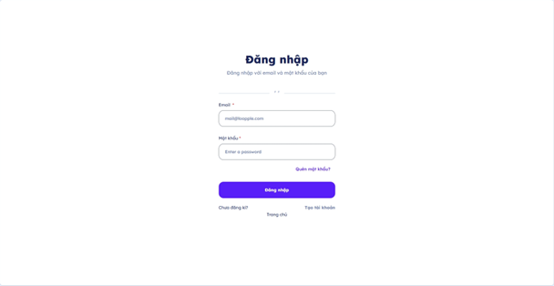 | 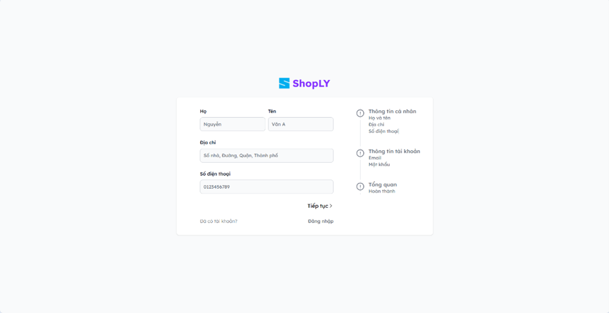 |
| 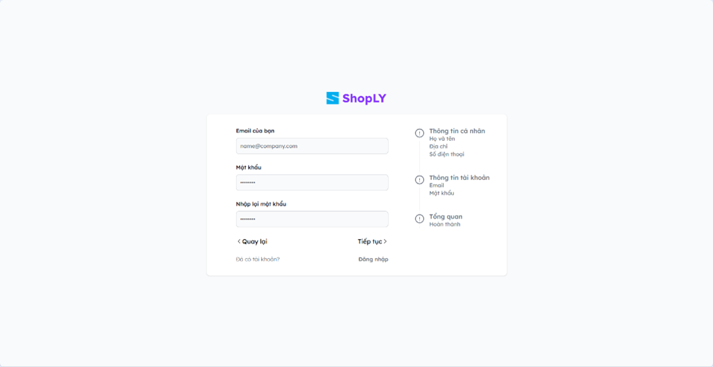 | 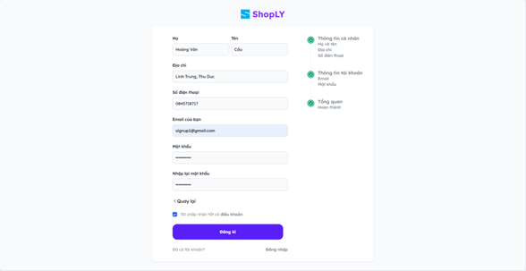 | 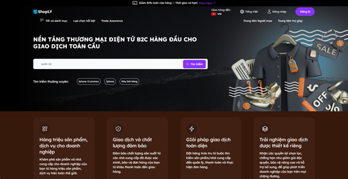 |
| 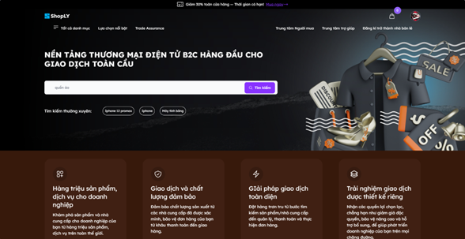 |  |  |
| 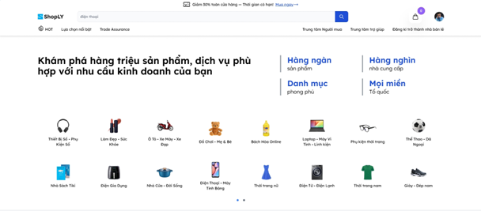 | 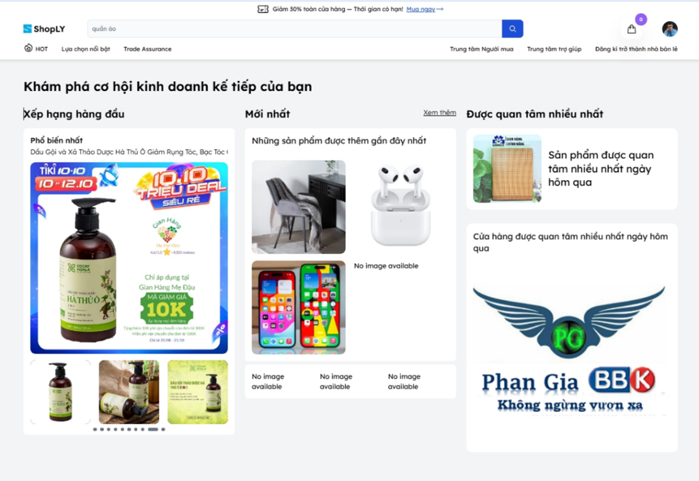 |  |
| 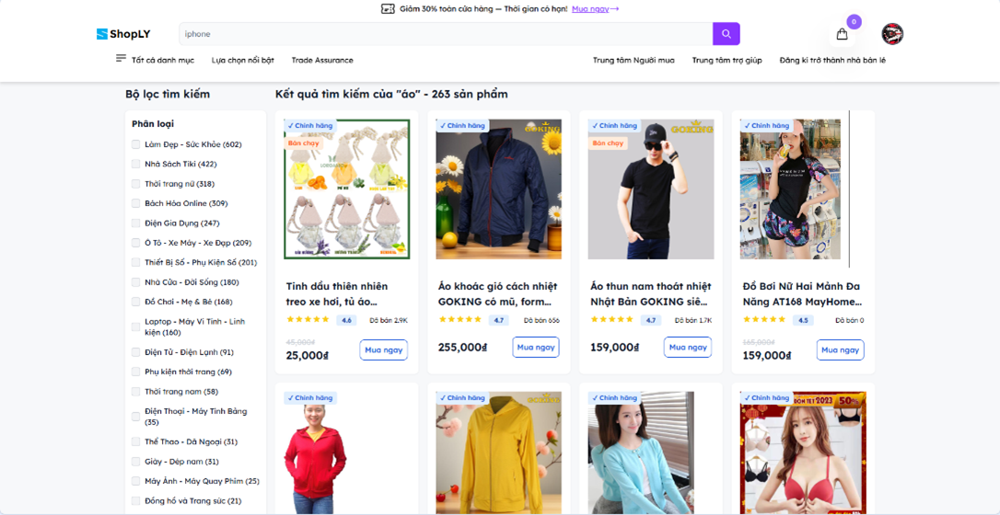 | 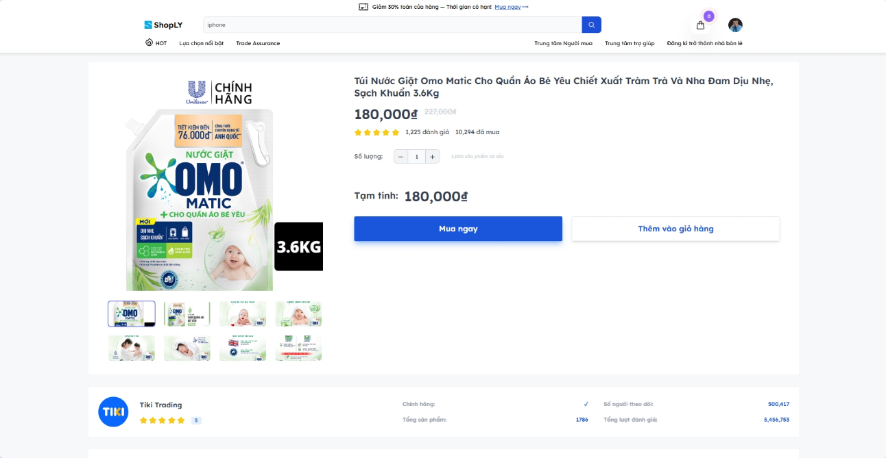 | 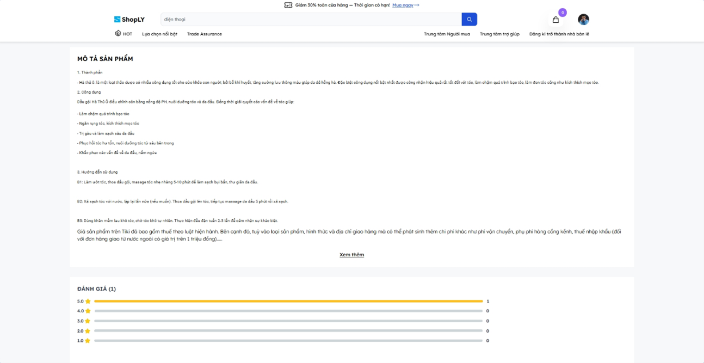 |
| 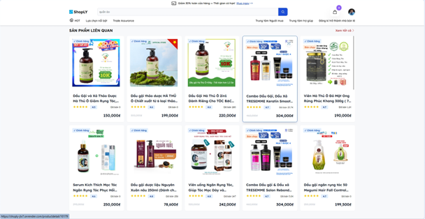 | 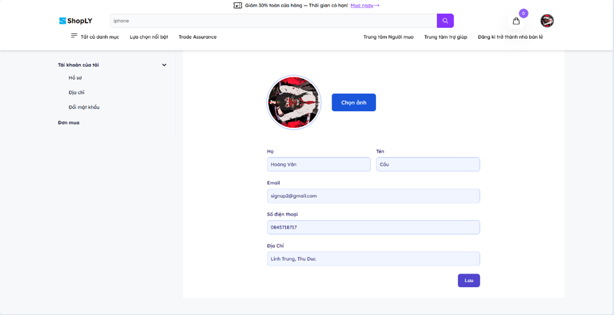 | 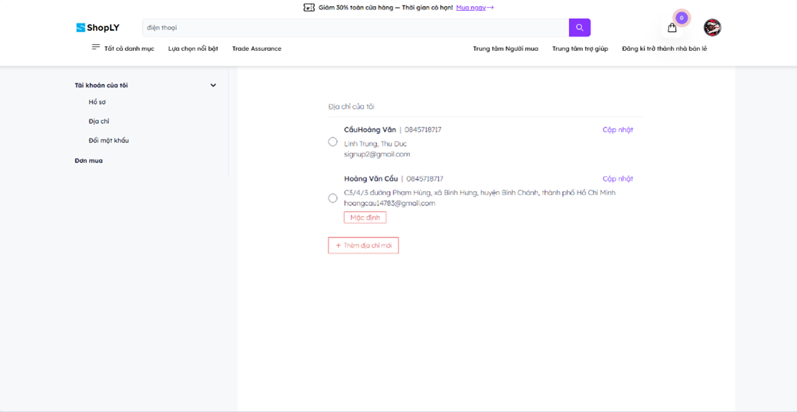 |
| 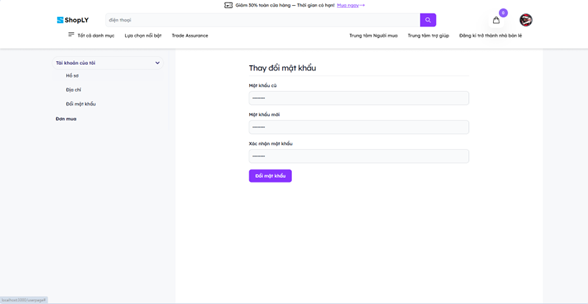 | 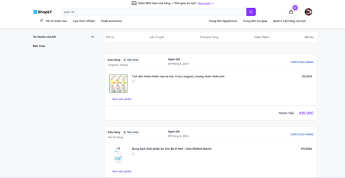 | 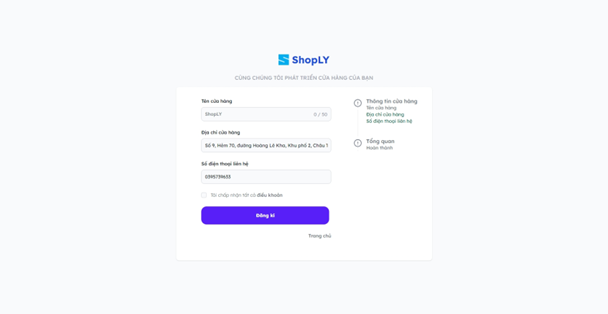 |
| 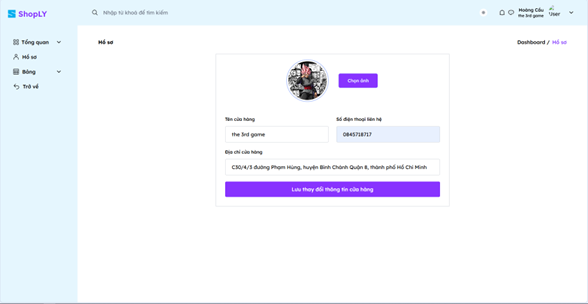 | 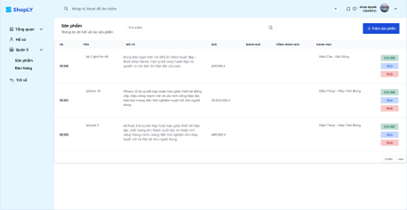 |  |
| 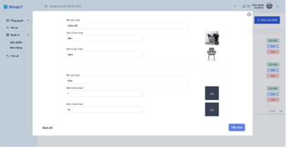 |  | 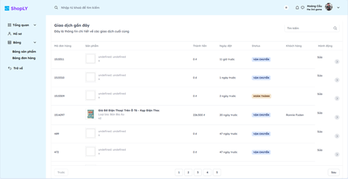 |
| 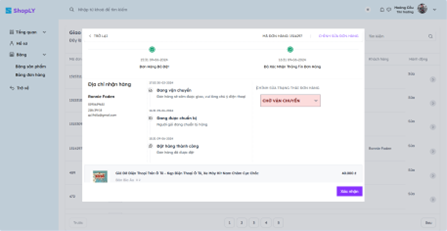 | 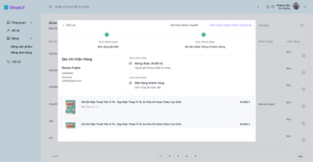 | 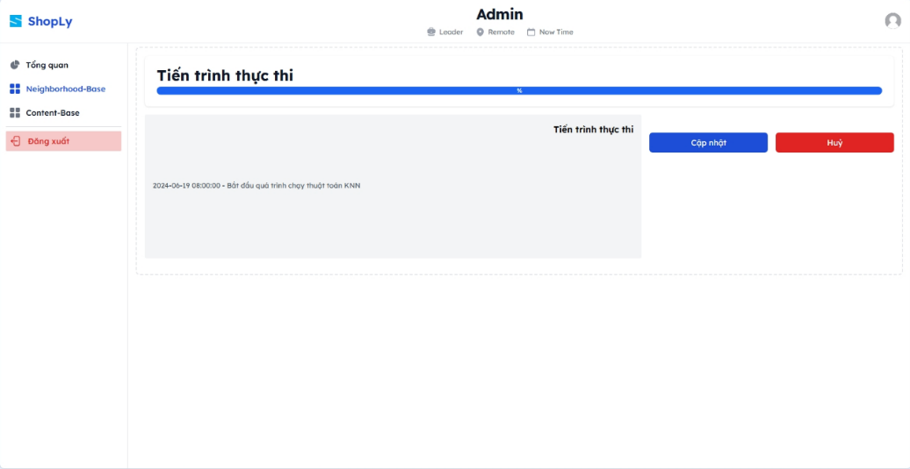 |
| 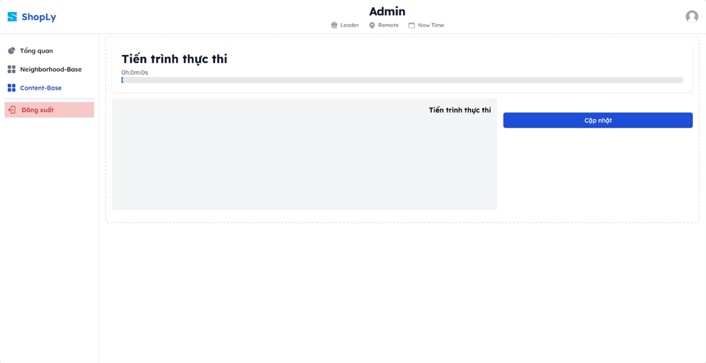 | | |

---

## 💻 Technical
* **Language**: Python • SQL • C# • JavaScript
* **Framework**: ReactJS • Tailwind CSS
* **Database**: MS SQL Server • Elasticsearch
* **Backend**: ASP.NET Core • EF Core • Identity • DI • FastAPI
* **Algorithm**: Neighborhood CF • Content-based • Matrix Factorization

---

## 🧠 Algorithms
* Neighborhood-based Collaborative Filtering
* Content-based Filtering
* Matrix Factorization

---

## 📺 Video demo
https://youtu.be/G3f2FhrMlRs

---

## 👥 Members
* NGUYỄN QUỐC ANH – 20120429 
* TÔ TRẦN SƠN BÁ – 20120431 
* HOÀNG  VĂN CẦU – 20120439 
* NGUYỄN ĐÌNH CƯỜNG – 20120446 
* NGUYỄN TRUNG HIẾU – 20120477 
* VƯƠNG TẤN PHÁT – 20120344

---

## ℹ️ Source
### Front-end
https://github.com/HoangCau-147/DATN_ShopRecommenderSystem/tree/Front_end

### Back-end
https://github.com/HoangCau-147/DATN_ShopRecommenderSystem/tree/Back-end

### NLP-model
https://github.com/HoangCau-147/DATN_ShopRecommenderSystem/tree/NLP_model

### Py-server
https://github.com/HoangCau-147/DATN_ShopRecommenderSystem/tree/PyServer